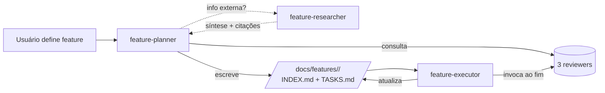

# AGENTS.md

Manual de bordo do `ffmpeg-rest`. Leia antes de tocar em qualquer coisa.

## TL;DR

- **Stack:** Bun + Elysia + BullMQ. Monorepo com `apps/` e `packages/`.
- **Deploy:** Railway — 2 serviços manualmente (api + worker, ambos apontando pro mesmo repo) + 1 Redis add-on. Cada serviço usa um `railway.json` próprio (`apps/api/railway.json`, `apps/worker/railway.json`) configurado em **Settings → Config-as-Code File**.
- **Princípio número um: simplicidade.** Reuse antes de criar; edite antes de adicionar; recuse complexidade especulativa.

## Como rodar localmente

```bash
docker compose up -d redis      # ou redis-server local na porta 6379
bun install
bun run dev:api                 # terminal 1
bun run dev:worker              # terminal 2
```

UI da API em <http://localhost:3000/openapi>.

## Workflow para criar ou modificar features



### Planejar
1. Invoque o agente `feature-planner` com o que você quer construir
2. Se precisar de info externa (versão de lib, CVE, comparação), o planner delega ao `feature-researcher`
3. Ele consulta os 3 reviewers (arquitetura, segurança, cobertura) e gera dois arquivos em `docs/features/<slug>/`
4. Revise `INDEX.md` (incluindo a seção "Pesquisas externas") e `TASKS.md`. Edite se quiser ajustar.

### Executar
1. Invoque o agente `feature-executor` com o slug da feature
2. Ele itera `TASKS.md` em ordem, marcando progresso, rodando lint+testes a cada passo
3. Ao final invoca os reviewers e abre tarefas pra cada alerta — resolve até `INDEX.md` ficar com status `done`
4. Atualiza diagramas Mermaid no `INDEX.md` ao terminar

### Revisar ad-hoc
- `architecture-reviewer` — após mudança estrutural
- `security-reviewer` — após tocar webhook delivery / ffmpeg / URL validation
- `test-coverage-reviewer` — antes de release
- `feature-researcher` — pesquisa externa pontual fora do contexto de uma feature

## Onde encontrar cada coisa

| Você quer entender... | Vá para |
|---|---|
| Visão geral, fluxo, ADRs | [`docs/ARCHITECTURE.md`](docs/ARCHITECTURE.md) |
| Status e tarefas de uma feature | `docs/features/<slug>/INDEX.md` e `TASKS.md` |
| Schemas Zod (validação + payload de jobs) | `packages/shared/src/schemas/` |
| Entrypoint da API | `apps/api/src/index.ts` |
| Entrypoint do Worker | `apps/worker/src/index.ts` |
| Lógica do ffmpeg | `packages/ffmpeg/src/` |
| Cliente S3/R2 | `packages/storage/src/` |
| Conexão Redis | `packages/redis/src/` |
| Validação de env | `packages/shared/src/env.ts` |
| Validação anti-SSRF de webhook | `packages/shared/src/security/url-validator.ts` |
| Tasks pendentes do projeto | `docs/features/*/TASKS.md` (linhas com `[ ]`) |
| Decisão histórica | `docs/ARCHITECTURE.md` (seção ADRs) ou `docs/features/<slug>/INDEX.md` |

## Convenções

- **Lint:** `bun run lint` (Biome). Não desabilite regras sem registrar o porquê em `INDEX.md`.
- **Tipos:** `bun run typecheck` deve passar.
- **Testes:** `bun test`. Toda mudança de schema ou lógica de segurança exige teste.
- **Commits:** título imperativo curto, corpo opcional explicando *por quê*.
- **Branches:** uma por feature, nome igual ao slug do `docs/features/<slug>/`.
- **Comentários:** só pra *por quê* não-óbvio. Sem narração.

## Quando NÃO usar os agentes orquestradores

- Typo em string ou comentário
- Bump de versão de dependência
- Renomear variável local
- Ajuste de log

Esses casos são pequenos demais pra justificar o overhead de criar `INDEX.md`/`TASKS.md`. Faça direto.

## Antes de deployar no Railway (checklist obrigatório)

`bun run lint` e `bun test` **não exercitam o Dockerfile.** Erros como flag inválida no `bun install`, dep faltando, ou comando errado **só aparecem no build do Railway** — e custam um redeploy quebrado.

Antes de fazer push de qualquer mudança em **`Dockerfile`**, **`package.json`**, **`bun.lock`**, **`apps/*/railway.json`** ou **dependências de runtime**, rode:

```bash
bun run docker:check
```

Isso roda `docker build -t ffmpeg-rest:check .` localmente e replica fielmente o que o Railway vai fazer. Falhou aqui → vai falhar lá. Para o caminho completo (lint + typecheck + test + docker):

```bash
bun run predeploy
```

Em CI isso já roda automaticamente: o workflow [`.github/workflows/ci.yml`](.github/workflows/ci.yml) faz lint, typecheck, tests, hadolint e docker build em todo push/PR — então **se a CI passar, o Railway tem 99% de chance de buildar**.

Quem está executando uma feature (`feature-executor`): se a feature mudar qualquer arquivo da lista acima, **inclua `bun run docker:check` na fase final de validação**, não apenas `bun test`.

## Deploy no Railway (passo a passo)

Railway não cria múltiplos serviços automaticamente. Você cria os dois manualmente, e cada um lê seu próprio `railway.json` via Config-as-Code File.

1. Linkar o repo no Railway → cria o **primeiro serviço** (vira o `api`)
2. Em **Settings → Config-as-Code File**, apontar para `apps/api/railway.json`
3. Adicionar Redis pelo marketplace
4. **+ New Service → GitHub Repo → mesmo repo** (vira o `worker`)
5. Em **Settings → Config-as-Code File**, apontar para `apps/worker/railway.json`
6. Setar variáveis de ambiente em cada serviço:
   - `REDIS_URL = ${{Redis.REDIS_URL}}` (Reference Variable)
   - `S3_ENDPOINT`, `S3_BUCKET`, `S3_ACCESS_KEY`, `S3_SECRET_KEY`, `S3_PUBLIC_URL`, `S3_REGION`
   - Demais com defaults: `MAX_INPUT_BYTES`, `JOB_CONCURRENCY`, `WEBHOOK_CONCURRENCY`

Resultado: o serviço `api` roda `bun apps/api/src/index.ts` e o `worker` roda `bun apps/worker/src/index.ts`, ambos da mesma imagem Docker, isolados via `startCommand` no `railway.json`.

## Skills instaladas

Estas skills enriquecem o contexto do agente:

- `bun-runtime` — runtime patterns
- `use-railway` — deploy + serviços + variáveis
- `ffmpeg` — patterns do ffmpeg para conversão de áudio/vídeo

## Ambiente

Variáveis obrigatórias estão em [`packages/shared/src/env.ts`](packages/shared/src/env.ts) (validação Zod). A aplicação falha no boot se algo estiver faltando.
