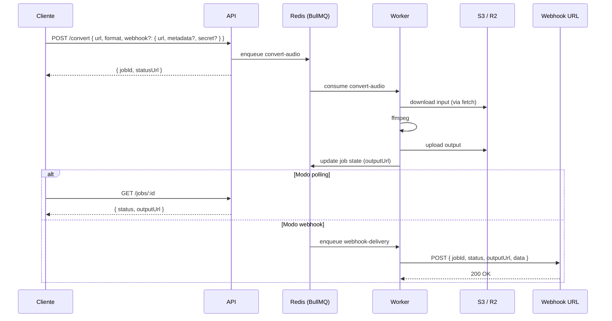
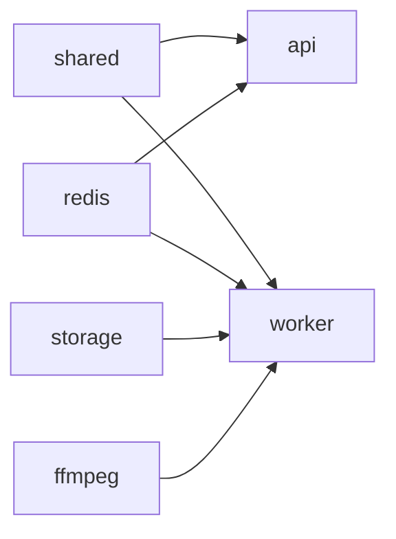

# Architecture — ffmpeg-rest

## Visão geral

API REST que recebe URL pública de áudio, baixa, converte com ffmpeg e sobe o resultado para um bucket S3-compatível (Cloudflare R2 ou similar). Volume estimado: 10.000+ requisições/dia, com picos.

## Diagrama de fluxo



## Estrutura do monorepo



| Local | Responsabilidade |
|---|---|
| `apps/api` | Servidor HTTP Elysia, valida requests, enfileira jobs, expõe OpenAPI |
| `apps/worker` | Workers BullMQ: `convert-audio` (ffmpeg) e `webhook-delivery` (notificação) |
| `packages/shared` | Zod schemas, env validation, queue constants, segurança (URL validator, HMAC) |
| `packages/redis` | Singleton ioredis com `maxRetriesPerRequest: null` |
| `packages/storage` | Cliente S3/R2 (`putObject`, `getPublicUrl`) |
| `packages/ffmpeg` | Wrapper `child_process.spawn` para ffmpeg, com timeout e parsing de stderr |

## ADRs

### ADR-001 — API + Worker separados em vez de replicas de serviço único

**Contexto:** ffmpeg é CPU-bound. Em pico (50–100 req/min), uma replica que está processando satura CPU; novos requests competem com ffmpeg pelo mesmo processo.

**Decisão:** dois serviços distintos no Railway (`api`, `worker`), conectados por Redis.

**Consequências:** API responde HTTP em milissegundos sempre. Cada serviço escala horizontalmente sem afetar o outro. Custo: complexidade de orquestração via fila.

### ADR-002 — Monorepo modular com Bun workspaces

**Contexto:** API e worker compartilham Zod schemas, cliente Redis, cliente S3, env validation. Pasta `src/` plana levaria a `../../lib/...` e duplicação de tipos.

**Decisão:** `apps/*` e `packages/*` com `"workspaces"` nativo do Bun (sem Lerna/Nx/Turborepo). Imports por nome (`@ffmpeg-rest/shared`).

**Consequências:** Reuso explícito, dependências por pacote, fácil extração futura. Custo: ~10 min de boilerplate.

### ADR-003 — Zod 3.24+ via Standard Schema, não TypeBox

**Contexto:** Elysia historicamente usa TypeBox; Elysia 1.4+ adicionou suporte a Standard Schema, que Zod 3.24+ implementa.

**Decisão:** Zod com `mapJsonSchema: { zod: z.toJSONSchema }` no plugin `@elysiajs/openapi`.

**Consequências:** Ergonomia superior, padrão de mercado, mesma fonte de verdade entre validação runtime e spec OpenAPI. Custo: pequeno overhead vs. TypeBox em performance crítica (não relevante aqui).

### ADR-004 — BullMQ + ioredis em vez de Bun.redis

**Contexto:** `Bun.redis` (cliente nativo) ainda não é compatível com BullMQ ([oven-sh/bun#23629](https://github.com/oven-sh/bun/issues/23629)).

**Decisão:** `ioredis` com `maxRetriesPerRequest: null` no Worker, conexão singleton em `packages/redis`.

**Consequências:** Compatibilidade total com BullMQ; perda de performance é desprezível porque ffmpeg domina o tempo de cada job.

### ADR-005 — `child_process.spawn` direto, não `fluent-ffmpeg`

**Contexto:** `fluent-ffmpeg` está com manutenção parada e adiciona uma camada de abstração desnecessária para nossos casos de uso (conversão de áudio).

**Decisão:** wrapper minimalista de ~30 linhas em `packages/ffmpeg` usando `Bun.spawn` (ou `child_process.spawn`) com array de argumentos.

**Consequências:** Controle total, parsing direto de stderr, zero overhead, sem dep abandonada. Custo: nós mantemos o wrapper.

### ADR-006 — URL pública de entrada + S3/R2 de saída

**Contexto:** Receber upload multipart amarra a API durante o tempo de upload e limita tamanho. Manter arquivos no disco amarra a uma única replica.

**Decisão:** Cliente fornece URL pública; worker baixa, converte, sobe pro bucket; cliente recebe URL final.

**Consequências:** Replicas stateless, escalabilidade horizontal direta, separação clara entre HTTP de baixa latência (API) e processamento longo (worker). Custo: cliente precisa ter o input acessível via HTTPS.

### ADR-007 — Webhook em queue dedicada com validação anti-SSRF

**Contexto:** Webhook que sai do servidor é vetor de SSRF (cliente pode passar `http://169.254.169.254/...`); falha do endpoint do cliente não pode forçar ffmpeg a rodar de novo.

**Decisão:**

- Queue separada `webhook-delivery` (não-mistura com `convert-audio`)
- Retry exponencial dentro da queue (5 tentativas, 30s → 6h)
- Validação de URL do webhook **antes de enfileirar** (na API) **e antes de cada POST** (no worker) — defesa em profundidade
- Blocklist de IPs privados, link-local, metadata cloud
- `redirect: "manual"` no fetch (3xx vira falha de validação, não bypass)
- HMAC-SHA256 opcional via `webhookSecret` no body, header `X-Signature`

**Consequências:** Cliente pode polling **ou** webhook (ou os dois — webhook é só notificação). ffmpeg roda uma única vez por job. SSRF é bloqueada em duas camadas.

## Ciclo de vida de um job

1. `POST /convert` — API valida com Zod, valida URL do webhook (se houver), enfileira em `convert-audio`, retorna `jobId`
2. Worker `convert-audio` consome:
   - Baixa input com `fetch` streaming, valida `Content-Length` ≤ `MAX_INPUT_BYTES`
   - Roda ffmpeg com array de args, output em `/tmp/{jobId}/output.{format}`
   - Sobe pro R2 com chave `{jobId}.{format}`
   - Atualiza estado do job com `outputUrl`
3. **Se** havia `webhook`:
   - Worker enfileira em `webhook-delivery` com `{ url, payload, secret? }`
   - Worker `webhook-delivery` faz POST com retries
4. Cliente recebe via webhook ou consulta via polling em `GET /jobs/:id`

## Como rodar localmente

Pré-requisitos: Bun ≥ 1.3, Docker (para Redis), ffmpeg no PATH para testes que usam binário real.

```bash
bun install
docker compose up -d redis
bun run dev:api & bun run dev:worker
```

## Como deployar no Railway

1. Push pro GitHub, criar projeto Railway, linkar repo
2. Adicionar Redis pelo marketplace
3. Criar dois serviços apontando para o mesmo Dockerfile:
   - Serviço `api` com `buildArgs.SERVICE=api`
   - Serviço `worker` com `buildArgs.SERVICE=worker`
4. Setar env vars compartilhadas via "Reference Variables" (REDIS_URL, S3_*, etc.)
5. Healthcheck do `api` em `/health`

## Como adicionar um novo codec/operação

1. Adicione o formato ao `z.enum` em `packages/shared/src/schemas/convert.ts`
2. Atualize a lógica de `packages/ffmpeg/src/index.ts` (mapeamento `format` → args ffmpeg)
3. Adicione testes em `packages/shared/tests/` e `packages/ffmpeg/tests/`
4. Atualize `INDEX.md` da feature correspondente
