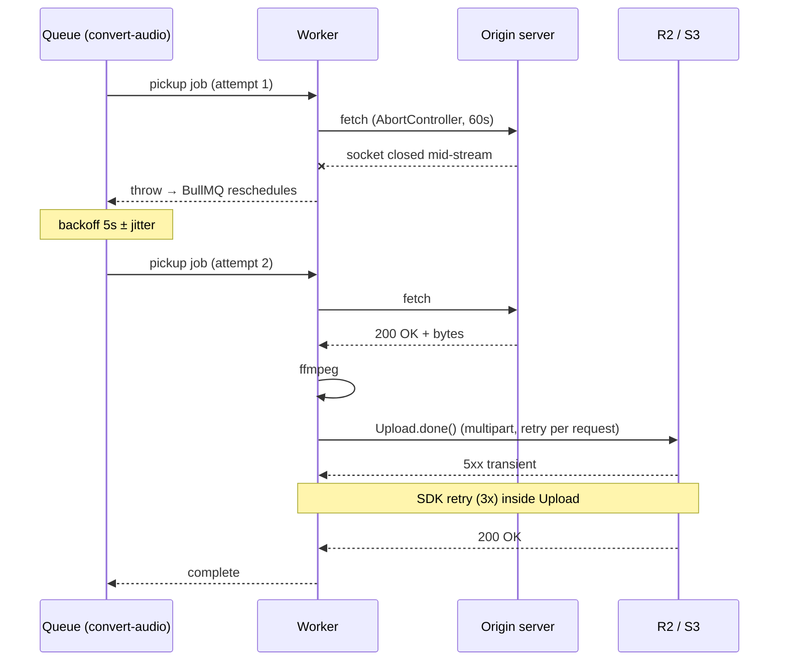
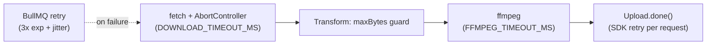

# Harden Network Resilience

**Slug:** `harden-network-resilience`
**Status:** `done`
**Criada em:** 2026-05-03
**Última atualização:** 2026-05-03

## Resumo

Tornar a pipeline `convert-audio` resiliente a hiccups transitórios de rede em três pontos: download do áudio, upload pro R2/S3, e retry no nível da fila. Erros de rede recentes em produção (`non-retryable streaming request`, `socket connection was closed unexpectedly`, `internal error / please try again`) hoje viram `failed` na primeira tentativa, sem retry.

## Motivação

Três classes de erro foram observadas em jobs reais:

1. `non-retryable streaming request` + `internal error` no upload — causados por `PutObjectCommand` recebendo `Body: createReadStream(filePath)`. Stream é consumida na 1ª tentativa; AWS SDK não consegue retry porque a stream está vazia. R2 hiccup transitório (5xx) fica "não-retriável" pelo SDK.
2. `socket connection was closed unexpectedly` no download — servidor remoto fechou TCP mid-stream. Sem timeout no `fetch`, a falha aparece tarde e sem mensagem clara.
3. Causa raiz amplificadora: `convert-audio` queue está **sem `attempts`** definidos. Default BullMQ é 1 → qualquer hiccup vira job morto.

A alternativa rejeitada é "ignorar e contar com sorte" — Cloudflare R2 tem instabilidade documentada e servidores remotos de áudio (CDNs de podcast, etc) não são confiáveis. Sem retry, a taxa de falha vista cresce com volume.

## Escopo

**Incluído:**
- Retry config no `convert-audio` queue (3 tentativas, backoff exponencial 5s/10s/20s, jitter 0.5)
- Substituir `PutObjectCommand` + `createReadStream` por `Upload` de `@aws-sdk/lib-storage` no `packages/storage`
- Timeout via `AbortController` manual (60s) e simplificação do streaming download em `apps/worker/src/download.ts` usando `Readable.fromWeb` + `Transform` que conta bytes (preservando o `MAX_INPUT_BYTES` enforcement)
- Adicionar suite de testes para `download.ts` (não existe hoje — gap pré-existente fechado)

**Não incluído (deliberadamente):**
- Retry no nível do download dentro de uma única attempt (ex: `p-retry` interno). O retry do BullMQ no nível do job já cobre — adicionar 2 camadas é over-engineering.
- Circuit breaker contra R2 / contra origin servers. Volume não justifica.
- Trocar `Bun.fetch` por `undici` para ter controle finer-grained sobre keepalive/idle timeout. Bun.fetch atende com `AbortController` manual.
- Mudar `webhook-delivery` queue (já tem retry funcionando).
- Cobertura unit do BullMQ retry em si (a lib testa upstream — replicar é desperdício).

## Arquivos afetados

- [`packages/shared/src/queue.ts`](packages/shared/src/queue.ts) — adicionar `CONVERT_RETRY_OPTIONS` ao lado de `WEBHOOK_RETRY_OPTIONS`
- [`apps/api/src/queues.ts`](apps/api/src/queues.ts) — aplicar `CONVERT_RETRY_OPTIONS` no `defaultJobOptions` do `convertAudio`
- [`packages/storage/package.json`](packages/storage/package.json) — adicionar dep `@aws-sdk/lib-storage`
- [`packages/storage/src/index.ts`](packages/storage/src/index.ts) — substituir `PutObjectCommand` + `createReadStream` por `Upload.done()`
- [`apps/worker/src/download.ts`](apps/worker/src/download.ts) — `AbortController` + `setTimeout` (não `AbortSignal.timeout`); substituir `Readable` artesanal por `Readable.fromWeb` + `Transform` que conta bytes; preservar `MAX_INPUT_BYTES` enforcement no streaming
- [`packages/shared/src/env.ts`](packages/shared/src/env.ts) — adicionar `DOWNLOAD_TIMEOUT_MS` (default 60000) com validação
- [`apps/worker/tests/download.test.ts`](apps/worker/tests/download.test.ts) **(novo)** — cobertura de timeout, size limit, erro 404, redirect-follow
- [`packages/storage/tests/index.test.ts`](packages/storage/tests/index.test.ts) **(novo)** — mock S3Client e validar que `Upload.done()` é invocado, content-type correto

## Decisões de design

- **Reuso:**
  - Padrão de retry já estabelecido em `WEBHOOK_RETRY_OPTIONS` ([packages/shared/src/queue.ts:15](packages/shared/src/queue.ts:15)). Adiciono a constante irmã `CONVERT_RETRY_OPTIONS`, aplico via spread em `apps/api/src/queues.ts` (mesmo padrão atual).
  - `AbortController` é Web API standard, sem dep extra.
  - `Readable.fromWeb` é Node built-in (`node:stream`), sem dep.
  - `Transform` para counting bytes é Node built-in.

- **Net new:**
  - Dep `@aws-sdk/lib-storage` (~150KB) — única dep nova. Justificativa: re-implementar o caminho de upload com retry-friendly Body manualmente é >50 linhas + risco. A dep é oficial AWS, mantida ativamente.
  - Env var `DOWNLOAD_TIMEOUT_MS` — para tornar o timeout configurável sem code change. Default 60s cobre 99% dos áudios <100MB em conexões razoáveis.

- **Trade-offs:**
  - **Retry de jobs com payload contendo `webhookSecret`:** o BullMQ persiste `job.data` no Redis em JSON cleartext. Re-tentar significa manter o secret em Redis até o job sumir do retention (`removeOnFail.age = 7 dias`). **Aceito** — Redis é interno, não há vazamento adicional vs cenário sem retry. **Adicionei tarefa explícita para confirmar que `console.log/error` no worker NÃO dumpam `job.data`.**
  - **Jitter 0.5:** previne thundering herd, mas adiciona variação não-determinística na latência. Aceito — em pico, é melhor 5–10s aleatórios distribuídos do que 5s todos juntos batendo em R2 ao mesmo tempo.
  - **`partSize` ignorado pelo `Upload` quando `totalBytes` é conhecido** ([issue 7379](https://github.com/aws/aws-sdk-js-v3/issues/7379)) — irrelevante para nossos arquivos < 100MB; a divisão automática é fina.

## Diagramas

### Caminho de retry de um job que falha

### Pontos guardados após a feature

## Pesquisas externas

### Como `@aws-sdk/lib-storage` Upload trata retries em 2026?

- **Resumo:** O `Upload` **não faz retry automático de parts** que falham permanentemente — quando uma part esgota retries, o upload inteiro aborta ([issue 2311](https://github.com/aws/aws-sdk-js-v3/issues/2311)). Porém, **cada request HTTP individual é retry-friendly** porque o `Upload` lê o Body de forma compatível com a retry strategy do `S3Client` (default: `standard`, 3 retries com backoff). Isso é o oposto de `PutObjectCommand` + `createReadStream`, onde a stream é consumida e SDK retry vira no-op. Default `partSize` é 5MB; `MAX_PARTS` é 10000 — para arquivos < 100MB, divisão automática funciona sem config explícita.
- **Implicações:** O `Upload` resolve os erros 1+2 vistos em produção via retry de cada request HTTP; não promete invulnerabilidade contra falhas catastróficas (rede totalmente down). Documentar esse limite no INDEX evita surpresa futura.
- **Confiança:** alta — issue 2311 é discussão oficial AWS, comportamento confirmado em vários reports.
- **Fontes:**
  - [lib-storage Upload does not retry if one part fails (#2311)](https://github.com/aws/aws-sdk-js-v3/issues/2311) — 2024-2026
  - [@aws-sdk/lib-storage on npm](https://www.npmjs.com/package/@aws-sdk/lib-storage) — 2026
  - [Upload class ignores partSize option (#7379)](https://github.com/aws/aws-sdk-js-v3/issues/7379) — 2026
- **Ferramentas usadas:** WebSearch

### `Bun.fetch` + `AbortController` em 2026 — bugs conhecidos?

- **Resumo:** `AbortSignal.timeout()` tem bug aberto ([#13302](https://github.com/oven-sh/bun/issues/13302)) onde o timeout não dispara quando o servidor é completamente inalcançável (DNS down, host unreachable). Workaround estabelecido: `AbortController` manual com `setTimeout(() => controller.abort(), ms)`. `AbortController` em si funciona corretamente nas versões 1.x. Issue [#29546](https://github.com/oven-sh/bun/issues/29546) (2026) afeta apenas signal em Promise top-level pura, não fetch.
- **Implicações:** **Não usar `AbortSignal.timeout(60_000)` direto no fetch — usar `AbortController` + `setTimeout` manual.** Comportamento idêntico exceto em servidor unreachable, onde manual continua funcionando.
- **Confiança:** alta — issues oficiais, workaround é o documentado pela própria equipe Bun.
- **Fontes:**
  - [AbortSignal.timeout and fetch not working when can't reach server (#13302)](https://github.com/oven-sh/bun/issues/13302) — 2024-2026
  - [Fetch | Bun docs](https://bun.com/docs/runtime/networking/fetch) — 2026
- **Ferramentas usadas:** WebSearch

### BullMQ 5 — config recomendada de retry para CPU-bound jobs em 2026?

- **Resumo:** Padrão produção 2026: `attempts: 3, backoff: { type: 'exponential', delay: 1000 }`. Fórmula: `2^(attempts-1) * delay`. Adicionar `jitter` (0 a 1) é best practice nova para evitar thundering herd quando muitos jobs falham simultaneamente por causa comum (ex: R2 throttling). Para jobs CPU-bound longos como ffmpeg, vale aumentar o `delay` base (5s em vez de 1s) — desperdiçar CPU em retry imediato é caro.
- **Implicações:** Usar `attempts: 3, delay: 5000, jitter: 0.5`. Backoff efetivo: ~5s, ~10s, ~20s, com variação aleatória de 50%. Total max ~35s antes de marcar como `failed`.
- **Confiança:** alta — três fontes 2026 com mesma recomendação, BullMQ 5.71 ainda atual.
- **Fontes:**
  - [Retrying failing jobs | BullMQ docs](https://docs.bullmq.io/guide/retrying-failing-jobs) — 2026
  - [How to Implement Job Retries with Exponential Backoff in BullMQ](https://oneuptime.com/blog/post/2026-01-21-bullmq-retry-exponential-backoff/view) — 2026-01-21
  - [How to Build Production-Grade Background Job Queues with BullMQ 5 (2026)](https://dev.to/1xapi/how-to-build-production-grade-background-job-queues-with-bullmq-5-in-nodejs-2026-guide-1ik) — 2026
- **Ferramentas usadas:** WebSearch

## Notas dos revisores

### Arquitetura (T-rev-1) — **PASS**

- Dep `@aws-sdk/lib-storage` em `packages/storage` é congruente com a responsabilidade do package (cliente S3/R2). Não viola ADRs.
- Retry config centralizada em `packages/shared/src/queue.ts` segue padrão existente (`WEBHOOK_RETRY_OPTIONS`). Sem nova abstração introduzida.
- `apps/api/src/queues.ts` continua como ponto único de instanciação das queues.
- Sem dependência cíclica. `grep -rn "@ffmpeg-rest/ffmpeg" apps/api/src/` vazio (worker-only mantido).

### Segurança (T-rev-2) — **PASS_WITH_NOTES**

- **Size limit no streaming** verificado em código (`Transform` em `download.ts`) e teste passa (cenário "rejects when body bytes exceed maxBytes").
- **Validação anti-SSRF do webhook** intacta (`apps/worker/src/processors/webhook-delivery.ts:48` continua com `redirect: "manual"`; URL validation pré-existente preservada).
- **Audit T8** completo: `console.log/error` no worker usam apenas `job?.id` e `err.message`. Nenhum dump de `job.data`.
- `DOWNLOAD_TIMEOUT_MS` é numérico (Zod `.number().int().positive()`) — sem risco de injection.
- **Note (não regressão, mas registrar):** `apps/worker/src/download.ts` usa `redirect: "follow"`. Não adicionamos validação anti-SSRF na URL de input, porque o perfil de risco é diferente do webhook (cliente confiável, leitura, e era assim antes desta feature). Se quiser endurecer: feature separada (`harden-input-url-ssrf`) com validação síncrona + DNS reverse-check antes do fetch.

### Cobertura de testes (T-rev-3) — **PASS**

`bun test --coverage` no commit final mostra:

| Arquivo da feature | Lines | Funcs | Target |
|---|---|---|---|
| `packages/storage/src/index.ts` | 100% | 100% | ≥ 70% ✅ |
| `apps/worker/src/download.ts` | 87% | 80% | ≥ 80% ✅ |
| `packages/shared/src/queue.ts` | 100% | 100% | ≥ 90% ✅ |
| `packages/shared/src/env.ts` | 100% | 100% | ≥ 90% ✅ |

**Cobertura global:** 94% lines / 90% funcs em 86 testes (eram 71 antes da feature; +15 testes). Sem regressão em arquivos não tocados.

Linhas não cobertas em `download.ts` (45, 55-60) são paths de erro do `Readable.fromWeb` quando o body é null — caminho defensivo, não exercitável sem mockar profundamente o `Response`.
